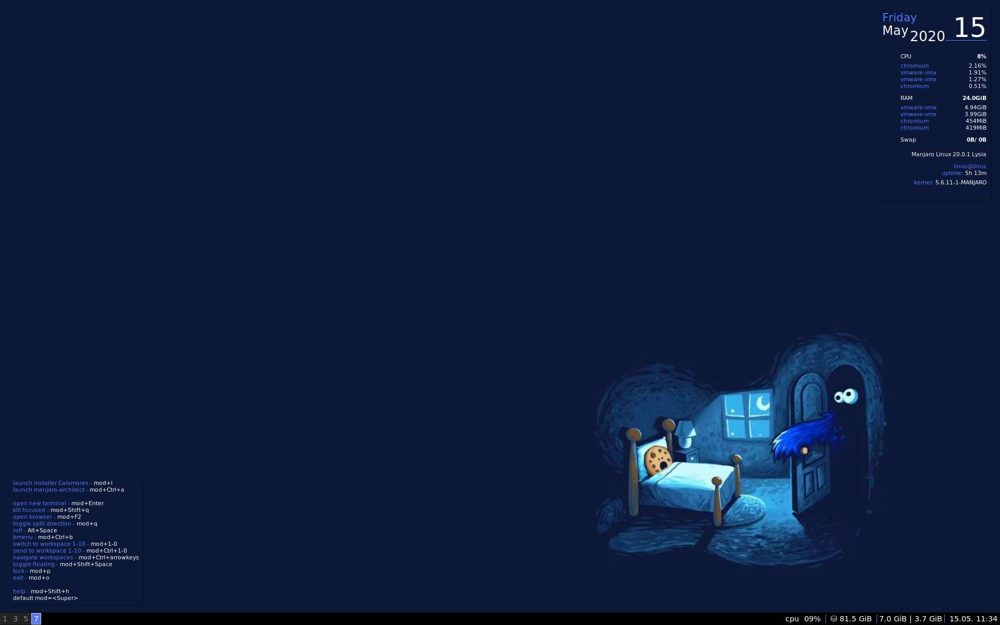

# Manjaro i3 dotfiles

## Installation instruction

### 1: Installing packages

Firstly install aurman and headers for current kernel from pamac.

Then type this commands:
```
$ aurman -Syu --noconfirm cherrytree vmware-workstation keepnote rtl8812au422-dkms-git protonvpn-cli-ng vscodium-bin libpdfium-nojs megasync wps-office clion webstorm pycharm-professional postman-bin
```
```
$ sudo pacman -Syu --noconfirm keepassxc unclutter nvm redshift ghidra bleachbit rofi gxkb veracrypt discord telegram-desktop chromium calibre krita parole audacity obs-studio qbittorrent polybar flameshot udiskie compton kitty emacs gulp nodejs postgresql
```

### 2: Running script 

Clone this git repository:
```
$ git clone https://github.com/Kegbi/i3-config.git
```

Go to the script folder:
```
$ cd i3-config
```

Change script format to executable:
```
$ chmod +x install.sh
```

Run script with your linux account name as a parameter:
```
$ sudo ./install.sh linux_username
```

### 3: Enabling themes

Change themes in lxappearance, qt5ct, lightdm-settings and reload your config (Super+Shift+r by default).

### 4: Enjoy :)

